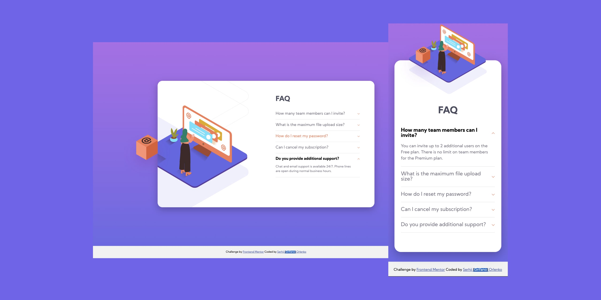

# Frontend Mentor - Stats preview card component solution

This is a solution to the [build out a FAQ accordion card challenge on Frontend Mentor](https://www.frontendmentor.io/challenges/faq-accordion-card-XlyjD0Oam/hub/faq-accordion-card-iXayDDWmd). Frontend Mentor challenges help you improve your coding skills by building realistic projects. 

## Table of contents

- [Overview](#overview)
  - [The challenge](#the-challenge)
  - [Screenshot](#screenshot)
  - [Links](#links)
- [My process](#my-process)
  - [Built with](#built-with)
  - [What I learned](#what-i-learned)
  - [Continued development](#continued-development)
  - [Useful resources](#useful-resources)
- [Author](#author)
<!-- - [Acknowledgments](#acknowledgments) -->

## Overview

### The challenge

Users should be able to:

- Readings the questions
- Close/Open the next question by clicking on that

### Screenshot



### Links

- Solution URL: [Solution](https://www.frontendmentor.io/solutions/htmlandcss-javascript-faq-component-mluOgfvAf)
- Live Site URL: [Live](https://grifano.github.io/FrontendMentor__FAQ-accordion/)

## My process

### Built with

- Semantic HTML5 markup
- JavaScript
- CSS custom properties
- Flexbox
- Responsive images
- Responsive Website

### What I learned

Using "picture" tag, browser know what image should to load depending on viewport width 😀

```html
<picture>
	<source media="(max-width: 799px)" srcset="images/image-header-mobile.jpg">
	<source media="(min-width: 800px)" srcset="images/image-header-desktop.jpg">
	
</picture>
```
I decide to create a custom arrow for tab headers Instead to use a svg. But I was wondering is that very complicated? Off Course a easy way is to use svg as a background image
```css
.accordion__header::before,
.accordion__header::after {
	content: "";
	display: block;
	position: absolute;
	width: 6px;
	height: 1px;
	top: 50%;
	right: 0;
	background-color: hsl(14, 88%, 65%);
}
.accordion__header::before {
	right: 4px;
	transform: rotate(45deg);
}
.accordion__header::after {
	transform: rotate(-45deg);
}
.accordion__header::before {
	transform: rotate(45deg);
}
```
Using the loop for addEventListner for each headin of faq
```js
	for (var i = 0; i < accordionTabHeaders.length; i++) {
		accordionTabHeaders[i].addEventListener('click', function (event) {
			setActiveTab(event.currentTarget);
			showContent(event.currentTarget);
		})
	}
```
And this part is not clearly Understand For me. Why in if condition don't use an equal operator? It supposes if activeTab is true then run a code, but why activeTab Should be "true"? 
```js
function setActiveTab(tab) {
	var activeTab = document.getElementById('accordion').querySelector('.active');
	if (activeTab) {
		activeTab.classList.remove('active');
	};
	// if not, add active class
	tab.classList.add('active');
}
```

### Continued development

I want to continue to learn a JavaScript. Currently, I'm working on Course from Udemy. App Brewery Web Developer Bootcamp. And to do practice, practice and practice one more 😉

### Useful resources

["Creating Accordion with Javascript"](https://medium.com/@vikash20186/creating-accordion-with-javascript-a33743655474)


## Author

- Website - [Serhii "{Grifano}" Orlenko"](https://grifano.webflow.io/)
- Frontend Mentor - [@Grifano](https://www.frontendmentor.io/profile/Grifano)
- Twitter - [@Grifano](https://twitter.com/OrlenkoSerhii)
- LinkedIn - [@Grifano](https://www.linkedin.com/in/serhii-orlenko-44aaa4a3/)

## Acknowledgments

To [Vikash Agarwal](https://medium.com/@vikash20186) for his amazing post that helps me with Accordion.
